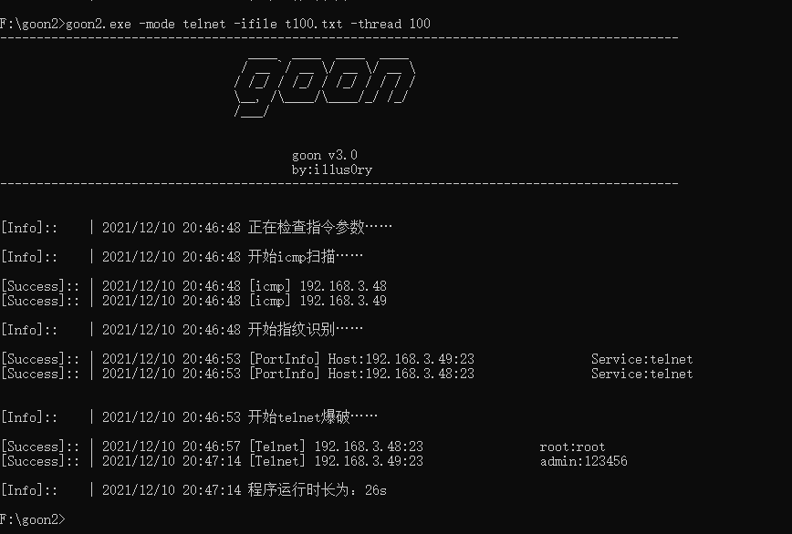

## 工具简介
```
---------------------------------------------------------------------------------------------
                                  ____  ____  ____  ____
                                 / __ `/ __ \/ __ \/ __ \
                                / /_/ / /_/ / /_/ / / / /
                                \__, /\____/\____/_/ /_/
                                /___/

                                        goon v3
                                        by:i11us0ry
---------------------------------------------------------------------------------------------

goon,集合了fscan和kscan等优秀工具功能的扫描爆破工具。
功能包含：ip探活、port扫描、web指纹扫描、title扫描、fofa获取、ms17010、mssql、mysql、postgres、redis、ssh、smb、rdp、telnet等爆破
以及如netbios探测等功能。

```

## 使用帮助

#### 问题强调：
- 只提供amd64样品，其他可按需自行编译

- 关于日志打印如下错误信息：
- `wsarecv: An existing connection was forcibly closed by the remote host.`
- 解决方案：注释掉如下代码重新编译
- `github.com/go-sql-driver/mysql/packets.go 中注释 errLog.Print(err) `

- 关于日志打印如下错误信息：
- `Unsolicited response received on idle HTTP channel starting with`
- 解决方案：注释掉如下代码重新编译
- `net/http/transport.go 中 log.Printf("Unsolicited response received on idle HTTP channel starting with %q; err=%v", buf, peekErr)`

#### 参数说明：
可选mode如下:
```
  all:            默认选项,包含ip-port(web)-title-finger-back-ftp-ms17010-mssql-mysql-postgres-redis-ssh-smb-rdp-telnet-netbios
  webscan:        包含ip-port(web)-title-finger
  brute:          包含ip-ftp-ms17010-mssql-mysql-postgres-redis-ssh-smb-rdp-telnet
  ip:             ip探活,执行-np可绕过探活
  port:           端口扫描,执行-web直接探测http/https
  fofa:           fofa资产获取,执行-web输出host时添加http(fields为多个时host放在最后一位)
  title:          title扫描
  finger:         web指纹
  dir:            单路径扫描
  tomcat:         tomcat爆破
  ftp:            ftp爆破,其他ms17010,mssql,mysql,postgres,redis,ssh,smb,rdp,telnet同理
  netbios:        netbios探测
```

指令如下：
```
  -body string      dir返回内容如:root:x:0:0，支持正则
  -code int         dir返回code如:200、302 (default 200)
  -dir string       dir批量请求路径，如:/actuator/env
  -fields string    fofa返回类型如:ip,port
  -header string    dir返回头部如:rememberMe，支持正则
  -ifile string     输入文件，支持webscan、brute、fofa及其他当个功能
  -ip string        如:127.0.0.1、127.0.0.1/24、127.0.0.1-255
  -key string       fofa查询语句如:domain='fofa.so'
  -mode string      运行模式如:webscan、brute、title、fofa、mysql、mssql等 (default "all")
  -np  bool         np，不进行icmp存活检测
  -num int          fofa请求数量如:100、10000
  -ofile string     输出文件
  -pass string      指定密码
  -pfile string     指定密码字典
  -port string      扫描端口如:80,443-445,8000-9000
  -thread int       thread
  -time int         timeout
  -ufile string     指定用户字典
  -url string       url
  -user string      指定用户
  -web bool         port和fofa扫描host输出格式，如:127.0.0.1输出http://127.0.0.1:80
```

## 更新说明
- 2022年07月31日 v3.4
	- dir扫描支持正则
	- 修复finger一些bug
	- 修复-ifile一些bug
	- 删除备份扫描功能

- 2022年03月01日 v3.3
   - 优化redis爆破出错问题
   - 优化netbios扫描超时问题
   - ip探活改为先探测.1和.255的方式
   - 日志输出改英文避免乱码

- 2022年02月21日 v3.2
   - 更新fofa接口，每次请求添加了0.5s的间隔

- 2021年12月13日 v3.1
   - 新增tomcat爆破

- 2021年12月10日 v3.0
   - 新增了很多功能，也重写了架构，虽然多多少少还有些许问题，但整体比以前好用了许多
   - rdp爆破模块用的开源的grdp
   - telnet爆破目前只做了win7和ubantu下的telnet服务，其他unix或嵌入式的还没测试
   - 所有爆破都不介意使用过多密码表测试

## 示例截图

#### 默认情况
成果为一个golang可执行文件和一个yaml配置文件，若无配置文件可以先运行goon生成默认配置文件


#### 单独调用telnet模块
这是更新telnet模块后的截图



#### 单独调用redis模块并指定密码


#### fofa模块批量获取资产


#### dir模块探测spring未授权访问漏洞


